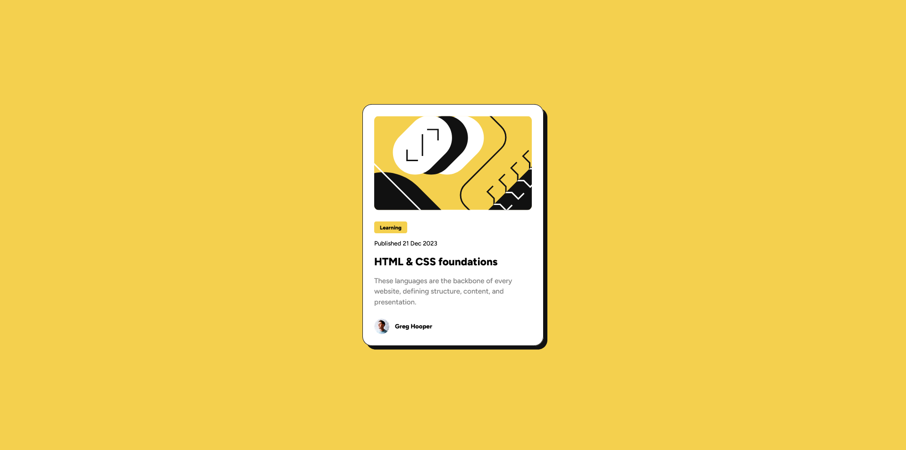

# Frontend Mentor - Blog preview card solution

This is a solution to the [Blog preview card challenge on Frontend Mentor](https://www.frontendmentor.io/challenges/blog-preview-card-ckPaj01IcS). Frontend Mentor challenges help you improve your coding skills by building realistic projects. 

## Table of contents

- [Overview](#overview)
  - [The challenge](#the-challenge)
  - [Screenshot](#screenshot)
  - [Links](#links)
- [My process](#my-process)
  - [Built with](#built-with)
  - [What I learned](#what-i-learned)
- [Author](#author)

## Overview
I built this website inside a monorepo to contain all Frontend Mentor challenges in a single repository.

### The challenge

Users should be able to:

- See hover and focus states for all interactive elements on the page

### Screenshot

### Links

- Solution URL: [Github](https://github.com/asdiAdi/portfolio/tree/main/apps/blog-preview-card)
- Live Site URL: [Vercel](https://cta-blog-preview-card.vercel.app/)

## My process

### Built with

- [React](https://reactjs.org/)
- [NX Monorepos](https://nx.dev/) - Monorepo
- [Vite JS](https://vitejs.dev/) - React Framework
- [Sass](https://sass-lang.com/) - For styling
- [Jest](https://jestjs.io/) - Testing Framework

**Note: These are just examples. Delete this note and replace the list above with your own choices**

### What I learned
@mixin rule from scss. This makes it easier to make classes which have the same properties.

## Author

- Website - In Progress
- LinkedIn - [@asdiAdi](https://www.linkedin.com/in/asdiAdi/)
- Github - [@asdiAdi](https://github.com/asdiAdi)
- Frontend Mentor - [@asdiAdi](https://www.frontendmentor.io/profile/asdiAdi)
